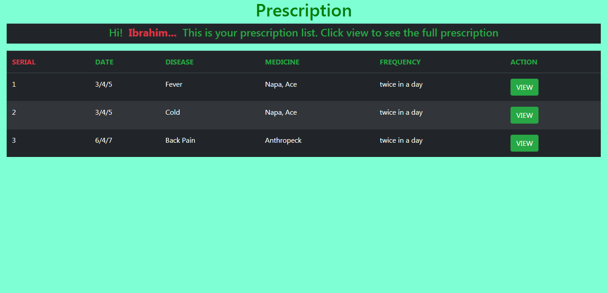
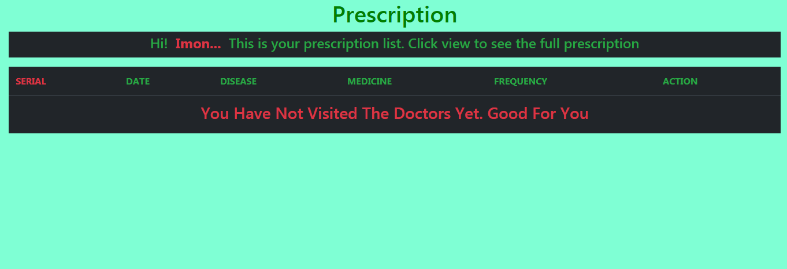

# Project Title
DOCTOR'S HOUSE

## Description

A java Spring MVC based  web app. It was made keeping intention in mind to present a digital prescription, 
also to keep the official record of the prescription. The functionality is described below. It was made for the medical center
of Mawlana Bhashani Science and Technology University
  * Studenta have to register on the system.
  * Each Student will maintain a personal profile.
  * Doctors are also registered here.
  * Whene ever a student visitis a doctor, The prescription will be saved under a unique student ID.
  * The student can view the prescription from any where by logging into his/her profile.
  * Thus the student need not to carry the prescription from pharmecy to pharmecy.\
  * Next time he visits the doctor, the doctor can also see the prescription from the system anytime
  * User can Edit his/her enlisted task anytime.
 

# Technology I have used
  ### Front End
     * jsp. 
     * HTML, CSS, JavaScript.
     * Bootstrap.
     * JSTL.
  ### Back End
     * java
  ### Frame Work
     * Spring MVC
  ### Database
     * MySql
     * H2 database engine.
     * Spring Jdbc Template.
  ### IDE
     * Netbeans (8.2)
  ### Build Tool
     * Maven
     
  ### Version control
     * GitHub
  ### Server
     * Apache Tomcat (7)
     
  #Screen Shots
  
  
  
  
  
  
  
  
  
  
  
  
  
  
